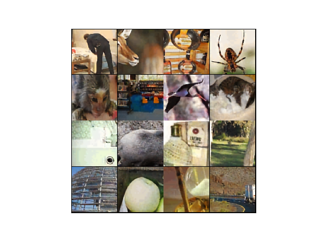

# VqVaeVideo

Use VQ-VAE to compress images/videos.

## Images

Original

Reconstructed (Compression ratio = 192)

## Videos

Original

Reconstructed (Compression ratio = 3072)

Reconstructed (Compression ratio = 9216)

